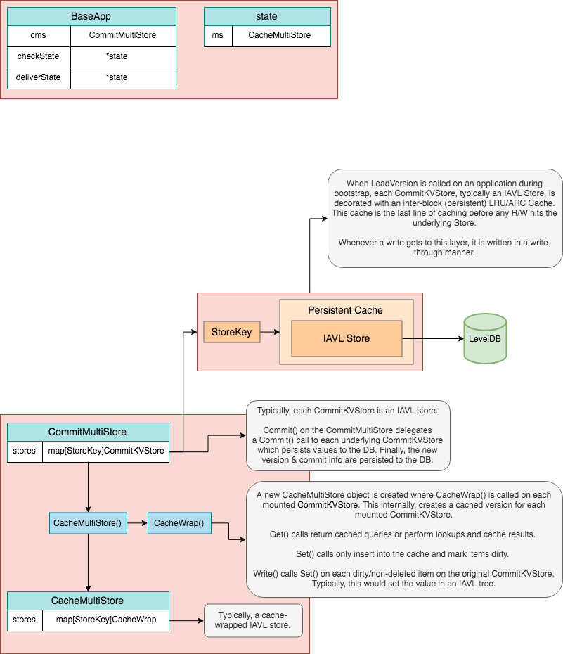
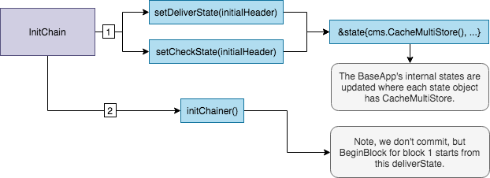

<!--
order: 1
-->

# BaseApp

이 문서는 SDK 애플리케이션의 핵심 기능들을 구현하는 abstraction 인 `BaseApp` 을 설명합니다. {synopsis}

## 사전 요구 학습

- [SDK 애플리케이션 해부](../basics/app-anatomy.md) {prereq}
- [SDK 트랜잭션 생명주기](../basics/tx-lifecycle.md) {prereq}

## 소개

`BaseApp` 은 이름대로 SDK 애플리케이션의 핵심을 구현하는 기본 타입입니다:

- 상태 기계와 기반 합의 엔진(예: Tendermint) 이 상호작용하기 위한 [애플리케이션 블록체인 인터페이스](#abci)
- 메시지와 쿼리를 적절한 모듈로 라우팅하기 위한 [서비스 라우터](#서비스-라우터-(service-routers))
- 수신된 ABCI 메시지에 근거하여 상태 기계가 다른 휘발성 상태를 가질 수 있도록 하는 다른 [상태들](#상태들(states)),

`BaseApp` 의 목적은 SDK 애플리케이션에 필수 레이어를 제공함으로써 개발자들이 그들의 커스텀 애플리케이션을 쉽게 확장할 수 있도록 하는 것입니다. 일반적으로
개발자들은 그들의 애플리케이션을 위해 아래와 같은 커스텀 타입을 만들 것 입니다.

```go
type App struct {
  // reference to a BaseApp
  *baseapp.BaseApp

  // list of application store keys

  // list of application keepers

  // module manager
}
```

`BaseApp` 으로 애플리케이션을 확장하면 `BaseApp` 모든 메서드에 접근할 수 있습니다. 이를 통해 개발자는 그들의 커스텀 애플리케이션을 원하는 모듈로 구성할 수 있고, ABCI와 서비스 라우터, 상태 관리 로직을 구현하는 힘든 일에 신경쓰지 않아도 됩니다.

## 타입 정의 (Type Definition)

`BaseApp` 타입은 Cosmos SDK 기반 애플리케이션에 중요한 매개 변수를 많이 가지고 있습니다.

+++ https://github.com/cosmos/cosmos-sdk/blob/v0.40.0-rc3/baseapp/baseapp.go#L46-L131

제일 중요한 요소들을 살펴봅시다.

> **Note**: 모든 매개 변수들을 설명하지 않으며, 제일 중요한 것들만 다룹니다. 타입 정의 전체 목록을 참고하세요.

먼저, 애플리케이션 부트스트랩 동안 초기화되는 중요 매개 변수들입니다.

- [`CommitMultiStore`](./store.md#commitmultistore) : 애플리케이션의 주요 저장소로써 [각 블록의 마지막](#commit) 에 커밋되는 표준 상태를
  유지합니다. 이 저장소는 **캐시되지 않으며**, 이는 애플리케이션의 휘발성 상태 (커밋되지 않은) 를 업데이트하는데 사용되지 않습니다. 애플리케이션의 각 모듈은
  멀티 저장소에 있는 `KVStores` 를 사용하여 해당 상태의 서브셋을 유지합니다.

- Database: `db` 는 `CommitMultiStore` 가 데이터 지속성을 처리하는데 사용됩니다.

- [메시지 서비스 라우터](#메시지-서비스-라우터-(Msg-service-router)): `msgServiceRouter` 는 적절한 `Msg` 서비스 모듈로 `sdk.Msg` 요청의
  라우팅을 가능케 합니다. 여기서 `sdk.Msg` 는 애플리케이션과 기반 합의 엔진 간의 인터페이스를 구현하는 ABCI 메시지가 아니라 애플리케이션 상태 업데이트를 하기
  위해 서비스가 처리해야 하는 트랜잭션 구성요소를 의미합니다.

- [gRPC 쿼리 라우터](#grpc-쿼리-라우터-(grpc-query-router)): `grpcQueryRouter` 는 gRPC 쿼리를 처리되기에 적절한 모듈로 라우팅합니다. 이
  쿼리들은 ABCI 메시지 자체는 아니지만, 관련 모듈들의 gRPC `Query` 서비스로 전달됩니다.

- [`TxDecoder`](https://godoc.org/github.com/cosmos/cosmos-sdk/types#TxDecoder): Tendermint 엔진에 의해 전달된 로우 트랜잭션
  바이트를 디코드하는데 사용됩니다.

- [`ParamStore`](#paramstore): 어플리케이션 합의 매개 변수를 get, set 할 때 사용됩니다.

- [`AnteHandler`](#antehandler): 이 핸들러는 트랜잭션이 수신되었을 때 서명 검증, 비용 지불, 기타 사전 메시지 확인에 사용됩니다.
  [`CheckTx/RecheckTx`](#checktx) 와 [`DeliverTx`](#delivertx) 중에 실행됩니다.

- [`InitChainer`](../basics/app-anatomy.md#initchainer),
  [`BeginBlocker` and `EndBlocker`](../basics/app-anatomy.md#beginblocker-and-endblocker): 애플리케이션이 Tendermint
  엔진으로부터 `InitChain`, `BeginBlock` and `EndBlock` ABCI 메시지를 수신할 때 실행되는 기능들입니다.


그리고, [휘발성 상태](#휘발성-상태(volatile-states)) (예: 캐시 상태) 를 정의하는데 사용되는 매개변수들 입니다:

- `checkState`: 이 상태는 [`CheckTx`](#checktx) 동안 업데이트되고, 그리고 [`Commit`](#commit) 시 재설정됩니다.
- `deliverState`: 이 상태는 [`DeliverTx`](#delivertx) 동안 업데이트되고, 그리고 [`Commit`](#commit) 시 `nil` 로 설정되며,
  `BeginBlock` 에서 다시 초기화됩니다.

마지막으로, 몇가지 더 중요한 매개 변수들:

- `voteInfos`: 이 매개 변수는 투표하지 않았거나, 제안자가 표를 포함하지 않아서 precommit 이 누락된 Validator 들의 목록을 포함합니다. 이 정보는
  [Context](#context) 가 가지고 있고, 애플리케이션이 부재 Validator 징계같은 다양한 곳에 사용할 수 있습니다.

- `minGasPrices`: 이 매개 변수는 노드에서 허용되는 최소 가스 가격을 정의합니다. 이는 **로컬** 매개 변수이며, 모든 노드가 각각 다른 `minGasPrices` 를
  설정할 수 있음을 의미합니다. 주로 스팸 방지 메커니즘으로 [`CheckTx`](#checktx) 동안 `AnteHandler` 에서 사용됩니다. 트랜잭션이
  [메모리 풀](https://tendermint.com/docs/tendermint-core/mempool.html#transaction-ordering) 에 들어가려면 트랜잭션 가스 가격이
  `minGasPrices` 의 최소 가스 가격 중 하나보다 커야합니다. (예: `minGasPrices == 1uatom,1photon` 일 때, 트랜잭션의 `gas-price` 는
  `1uatom` 이나 `1photon` 보다 반드시 커야합니다.)

- `appVersion`: 애플리케이션의 버전. [애플리케이션 생성자 함수](../basics/app-anatomy.md#constructor-function) 에서 설정됩니다.

## 생성자

```go
func NewBaseApp(
  name string, logger log.Logger, db dbm.DB, txDecoder sdk.TxDecoder, options ...func(*BaseApp),
) *BaseApp {

  // ...
}
```

`BaseApp` 생성자 함수는 아주 간단합니다. 주목할 만한 유일한 건 `BaseApp` 에 추가적인
[`options`](https://github.com/cosmos/cosmos-sdk/blob/v0.40.0-rc3/baseapp/options.go) 를 제공하여 순차적으로 실행할 수도 있다는 것
입니다. `options` 는 일반적으로 중요 매개 변수들을 위한 `setter` 함수들인데, 가지치기 옵션을 설정하는 `SetPruning()` 이나 노드의
`min-gas-prices` 를 설정하는 `SetMinGasPrices()` 같은 것들입니다.

자연적으로, 개발자는 그들의 애플리케이션 필요에 따라 추가 `options` 를 추가할 수 있습니다.

## 상태 업데이트

`BaseApp` 은 두 가지 주요 휘발성 상태와 루트 또는 메인 상태를 유지합니다. 메인 상태는 애플리케이션의 표준 상태이며, `checkState` 와 `deliverState`,
이 휘발성 상태들은 `Commit` 동안 메인 상태 사이에서 상태 전환을 처리하는데 사용됩니다.

내부적으로는 메인 또는 루트 상태인 `CommitMultiStore` 만 존재합니다.  
이 루트 상태를 통해, 우리는 _store branching_ (`CacheWrap` 함수가 수행) 이라고 불리는 메커니즘을 사용해 두 가지 휘발성 상태를 파생합니다. 타입들은
다음과 같이 묘사될 수 있습니다.



### InitChain 상태 업데이트

`InitChain` 동안, 두 가지 휘발성 상태인 `checkState` 와 `deliverState` 는 루트 `CommitMultiStore` 분기에 의해 설정됩니다. 이후의 읽기,
쓰기는 `CommitMultiStore` 의 분기된 버전에서 발생합니다. 메인 상태로의 불필요한 동작을 피하기 위해, 분기된 저장소의 모든 읽는 동작은 캐시됩니다.



### CheckTx 상태 업데이트

`CheckTx` 동안, 루트 저장소에서 마지막으로 커밋 상태를 기반으로 하는 `checkState` 는 모든 읽기 쓰기 동작에서 사용됩니다. 여기서는 `AnteHandler` 만
실행하고 트랜잭션의 모든 메시지에 대해 서비스 라우터가 존재하는지 검사합니다. `AnteHandler` 가 실행할 때, 이미 분기된 `checkState` 를 분기한다는 것에
주의하세요. 만약 `AnteHandler` 가 실패하면, 상태 전이가 `checkState` 에 반영되지 않습니다. 즉, `checkState` 는 성공 시에만 업데이트됩니다.


### BeginBlock 상태 업데이트

`BeginBlock` 동안, `deliverState` 는 이어지는 `DeliverTx` ABCI 메시지에서 사용하기 위해 설정됩니다. `deliverState` 는 루트 저장소의 마지막
커밋 상태를 기반으로 하고 분기됩니다. `deliverState` 는 [`Commit`](#commit) 할 때 `nil` 로 설정됩니다.


### DeliverTx 상태 업데이트

`DeliverTx` 의 상태 흐름은 상태 전이가 `deliverState` 에 발생하고, 트랜잭션 메시지가 실행된다는 점을 제외하면 `CheckTx` 와 거의 동일합니다.
`CheckTx` 와 유사하게, 상태 전이는 이중 분기 상태 -- `deliverState` 에서 발생합니다. 메시지 실행이 성공하면 결과는 `deliverState` 에 커밋됩니다.
만약 메시지 실행이 실패하면, `AnteHandler` 의 상태 전이가 유지됩니다.


### Commit 상태 업데이트

`Commit` 동안 `deliverState` 에서 발생한 모든 상태 전이는 최종적으로 루트 `CommitMultiStore` 에 쓰여지고, 디스크에 커밋되며 새로운 애플리케이션
루트 해시가 됩니다. 이 상태 전이는 이제 최종적인 것으로 간주됩니다. 마지막으로, `checkState` 는 새롭게 커밋된 상태로 설정되고 `deliverState` 는
`nil` 로 설정되어 `BeginBlock` 에서 재설정됩니다.


## ParamStore

`InitChain` 동안, `RequestInitChain` 은 `ConsensusParams` 를 제공합니다. `ConsensusParams` 는 증거 매개 변수 외에 최대 가스, 크기 등 블록
실행과 관련된 매개 변수를 포함합니다. 이 매개 변수들은 nil 이 아닌 경우, `BaseApp` 의 `ParamStore` 에 설정됩니다. `ParamStore` 는 실제로는
`x/params` 모듈 `Subspace` 에 의해 관리됩니다. 이로 인해 온체인(on-chain) 거버넌스를 통하여 매개 변수를 조정할 수 있습니다.

## 서비스 라우터 (Service Routers)

애플리케이션이 메시지와 쿼리를 수신할 때, 반드시 적절한 모듈로 라우팅해서 처리되게 해야 합니다. 라우팅은 `BaseApp` 의 메시지를 위한 `msgServiceRouter` 와
쿼리를 위한 `grpcQueryRouter` 를 통해 수행됩니다.


### 메시지 서비스 라우터 (`Msg` Service Router)

[`sdk.Msg`s](#../building-modules/messages-and-queries.md#messages) 는`CheckTx` 와 `DeliverTx` ABCI 메시지를 통해 Tendermint
엔진에서 보내진 트랜잭션에서 추출된 후 라우팅해야 합니다. 이를 위해 `BaseApp` 은 정규화된 서비스 메서드 (`string`, 각 모듈의 Protobuf `Msg` 서비스에
정의된) 를 적절한 모듈의 `MsgServer` 구현에 매핑하는 `msgServiceRouter` 를 가지고 있습니다.

[`BaseApp` 에 포함된 기본 `msgServiceRouter`](https://github.com/cosmos/cosmos-sdk/blob/v0.40.0-rc3/baseapp/msg_service_router.go) 는
상태가 없습니다. 그러나 일부 애플리케이션은 거버넌스가 특정 라우트를 비활성화 하거나 업그레이드 목적의 새로운 모듈을 가리키도록 허용하는 것과 같이 상태가 있는 라우팅
메커니즘의 사용을 원할 수 도 있습니다. 이러한 이유 때문에 `sdk.Context` 도 [`msgServiceRouter` 내 각각의 라우트 핸들러](https://github.com/cosmos/cosmos-sdk/blob/v0.40.0-rc3/baseapp/msg_service_router.go#L31-L32) 로 전달됩니다.
상태가 없는 라우터의 경우에는 `ctx` 를 무시해도 됩니다.

애플리케이션의 `msgServiceRouter` 는 [애플리케이션 생성자](../basics/app-anatomy.md#app-constructor) 에서 모든 애플리케이션 모듈로 초기화되는
애플리케이션 [모듈 관리자](../building-modules/module-manager.md#manager) 를 사용하여 모든 라우트로 초기화 됩니다. (`RegisterService`
메서드를 통해)

### gRPC 쿼리 라우터

`sdk.Msg` 와 유사하게, [`queries`](../building-modules/messages-and-queries.md#queries) 는 적절한 모듈의
[`Query` 서비스](../building-modules/query-services.md) 로 전달되어야 합니다. 이를 위해, `BaseApp` 에서는 정규화된 서비스 메서드 (`string`
,  그들의 Protobuf `Query` gRPC 에 정의된) 를 그들의 `QueryServer` 구현에 매핑하는 `grpcQueryRouter` 를 가지고 있습니다.
`grpcQueryRouter` 는 쿼리 처리 초반 단계에서 호출되는데, gRPC 엔드포인트로 gRPC 쿼리를 바로 보내거나 Tendermint 엔드포인트의
[`Query` ABCI 메시지](#쿼리-(query)) 를 통할 수 있습니다.

`msgServiceRouter` 와 마찬가지로, `grpcQueryRouter` 는 [애플리케이션 생성자](../basics/app-anatomy.md#app-constructor) 에서 모든
애플리케이션 모듈로 초기화되는 애플리케이션 [모듈 관리자](../building-modules/module-manager.md#manager) 를 사용하여 모든 쿼리 라우트로 초기화
됩니다. (`RegisterService` 메서드를 통해)

## 메인 ABCI 메시지들

[어플리케이션 블록체인 인터페이스](https://tendermint.com/docs/spec/abci/) (Application-Blockchain Interface, ABCI) 는 상태 기계를
합의 엔진과 연결하여 기능적 풀노드를 형성하는 일반적인 인터페이스입니다. 모든 언어로 래핑할 수 있으며, Tendermint 와 같은 ABCI 호환이 가능한 합의 엔진 위에
구축된 각각의 애플리케이션별 전용 블록체인에 의해 구현되어야 합니다.

합의 엔진은 주요한 두 가지 일을 처리합니다

- 네트워크 로직. 주로 블록 파트, 거래, 합의 투표를 퍼트리는 일을 합니다.
- 합의 로직. 블록의 형태로 트랜잭션들을 결정론적 순서로 만드는 일을 합니다.

트랜잭션의 유효성과 상태를 정의하는 일은 합의 엔진의 역할이 **아닙니다.** 일반적으로 트랜잭션은 합의 엔진이 `[]bytes` 형태로 처리하며, ABCI 를 통해서
애플리케이션에 전달되어 디코드되고 처리됩니다. 네트워크와 합의 처리의 중요한 부분 (예: 블록 시작, 블록 커밋, 확인되지 않은 트랜잭션 수신 등) 에서 합의 엔진은
상태 기계가 작동하도록 ABCI 메시지를 내보냅니다.

Cosmos SDK 를 기반으로 하는 개발자들은 `BaseApp` 에 인터페이스가 내장되어 있기 때문에 ABCI 를 직접 구현할 필요가 없습니다. `BaseApp` 에서 구현하는
주요 ABCI 메시지인 `CheckTx` 와 `DeliverTx` 를 살펴보겠습니다.

### CheckTx

`CheckTx` 는 확인되지 않은(즉, 아직 유효 블록에 포함되지 않은) 새로운 트랜잭션이 풀노드에서 수신될 때 합의 엔진에서 전송됩니다. `CheckTx` 의 역할은
스팸 트랜잭션들로부터 풀노드의 메모리 풀 (확인되지 않은 트랜잭션이 블록에 포함되기 전까지 저장되는 곳) 을 보호하는 역할을 합니다. 확인되지 않은 트랜잭션들은
`CheckTx` 를 통과한 경우에만 피어들에게 전달됩니다.

`CheckTx()` 는 _stateful_ 과 _stateless_ 확인 모두 수행할 수 있으나, 개발자들은 이를 가볍게하기 위해 노력해야 합니다. Cosmos SDK 에서는
[트랜잭션을 디코딩](./encoding.md) 한 후 `CheckTx()` 가 다음을 확인하도록 구현되어 있습니다.

1. 트랜잭션에서 `sdk.Msg` 를 추출합니다.
2. 각 `sdk.Msg` 의 `ValidateBasic()` 을 호출하여 _stateless_ 검사를 수행합니다. _stateless_ 검사가 _stateful_ 검사보다 계산 비용이 낮기
   때문에 이를 먼저 수행합니다. 만약 `ValidateBasic()` 이 실패하면, `CheckTx` 는 _stateful_ 검사를 진행하기 전에 반환되어서 자원을 절약합니다.
3. [계정](../basics/accounts.md) 의 비모듈과 관련있는 _stateful_ 검사를 수행합니다. 이 단계는 `sdk.Msg` 서명이 유효한지, 제공된 수수료는
   충분한지, 발신자 계정이 지불하기로 한 수수료를 지불할 충분한 자금이 있는지를 주로 검사합니다. 여기서 `sdk.Msg` 가 처리되는 것은 아니므로, 정확한
   [`gas`](../basics/gas-fees.md) 가 계산되지 않습니다. 일반적으로, [`AnteHandler`](../basics/gas-fees.md#antehandler) 는 가스를
   0으로 보내는 트랜잭션 스팸을 방지하기 위해, 트랜잭션에 제공된 `gas` 가 로우 트랜잭션 크기에 맞는 최소 가스 기준 보다 큰지 확인합니다.
4. 각 `sdk.Msg` 의 정규화된 서비스 메서드가 `msgServiceRouter` 내의 라우트와 일치하는지 확인해야 하지만, 실제로 `sdk.Msg` 를 처리하지는 않습니다.
   `sdk.Msg` 는 오직 표준 상태가 업데이트 되어야할 때에 처리되어야 하며, 이는 `DeliverTx` 에서 일어납니다.

두 번째와 세 번째 단계는 `CheckTx()` 가 `runTxModeCheck` 모드로 호출하는 `RunTx()` 함수 내의 `AnteHandler` 에 의해 수행됩니다.
`CheckTx()` 의 각 단계 동안, `checkState` 라는 특수한 [휘발성 상태](#휘발성-상태-(volatile-states)) 가 업데이트 됩니다. 이 상태는
[주요 표준 상태](#main-state) 를 수정하지 않고 각 트랜잭션의 CheckTx() 호출에 의해 트리거되어 임시 변화를 계속 추적하는데에 사용됩니다. 예를 들어,
트랜잭션이 `CheckTx()` 를 거칠 때, 트랜잭션 수수료는 `checkState` 내의 발신자 계정에서 공제됩니다. 첫 번째 트랜잭션이 처리되기 전에 만약 두 번째
트랜잭션을 같은 계정으로부터 수신하고, 첫 번째 거래 중 `checkState` 에서 모든 자금을 소비했다면, 두 번째 트랜잭션은 `CheckTx()` 가 실패하고 거부될
것입니다. 어떠한 경우라도 발신자의 계정은 트랜잭션이 실제로 블록에 포함되기 전까지는 수수료가 지불되지 않을 것입니다. 왜냐하면 `checkState` 는 절대로 주요
상태를 커밋하지 않기 때문입니다. `checkState` 는 블록이 [커밋](#commit) 될 때마다 주요 상태의 최신 상태로 재설정 됩니다.

`CheckTx` 는 [`abci.ResponseCheckTx`](https://tendermint.com/docs/spec/abci/abci.html#messages) 타입의 합의 엔진에 대한 응답을
반환합니다. 응답은 다음 항목들을 포함합니다:

- `Code (uint32)`: 응답 코드. 성공일 때 `0`
- `Data ([]byte)`: 결과 바이트.(있는 경우)
- `Log (string):` 애플리케이션 로그. 비결정적일 수 있습니다.
- `Info (string):` 추가 정보. 비결정적일 수 있습니다.
- `GasWanted (int64)`: 트랜잭션을 위해 요청한 가스입니다. 사용자가 트랜잭션을 생성할 때 제공합니다.
- `GasUsed (int64)`: 트랜잭션에 의해 소비된 가스입니다. `CheckTx` 동안 이 값은 로우 트랜잭션의 크기와 트랜잭션 바이트의 표준 가격을 곱하여 계산됩니다.
  예시:
  +++ https://github.com/cosmos/cosmos-sdk/blob/7d7821b9af132b0f6131640195326aa02b6751db/x/auth/ante/basic.go#L104-L105
- `Events ([]cmn.KVPair)`: 트랜잭션 인덱싱과 필터링을 위한 키값 태그. 자세한 내용은 [`event`s](./events.md) 를 참고하세요.
- `Codespace (string)`: 코드의 네임스페이스.


#### RecheckTx

`Commit` 이후, 블록에 포함된 트랜잭션을 제외한 후 노드의 로컬 메모리 풀에 남아있는 트랜잭션들에 대해 `CheckTx` 가 다시 실행됩니다. 블록이 커밋될 때마다
모든 트랜잭션에 대해서 재검사하는 것을 막기 위해, 설정 옵션 `mempool.recheck=false` 를 설정할 수 있습니다. Tendermint v0.32.1 부터 들어오는
트랜잭션이 새로운 (`ChecekTxType_New`) 인지 재검사하는 (`CheckTxType_Recheck`) 인지를 나타내는 `Type` 매개 변수를 `CheckTx` 함수가 사용할 수
있습니다. 이로 인해 `CheckTxType_Recheck` 중에 서명 검증과 같은 특정한 검사를 건너뛸 수 있습니다.

### DeliverTx

합의 엔진이 블록 제안을 받으면, 블록의 각 트랜잭션은 애플리케이션이 처리해야 합니다. 이를 위해 합의 엔진은 각 트랜잭션에 대한 애플리케이션에게 `DeliverTx`
메시지를 순차적으로 보냅니다.

어떤 블록의 첫 번째 트랜잭션이 처리되기 전에, [휘발성 상태](#휘발성-상태-(volatile-states)) 인 `deliverState` 가
[`BeginBlock`](#beginblock) 중에 초기화됩니다. 이 상태는 `DeliverTx` 를 통해 트랜잭션이 처리될 때마다 업데이트되며, `nil` 로 설정된 이후에 블록이
[커밋](#commit) 되면 [주요 상태](#주요-상태-(main-state)) 에 커밋됩니다.

`DeliverTx` 는 **`CheckTx` 와 정확히 동일한 단계**를 수행하는데, 세 번째 단계에서 약간 주의해야하고 다섯 번째 단계가 추가되었습니다:

1. `AnteHandler` 는 트랜잭션의 `gas-prices` 가 유효한지 체크하지 **않습니다.** 이는 `gas-prices` 와 비교하는 `min-gas-prices` 값이 노드
   로컬 값이기 때문에, 한 노드에서는 충분해도 풀노드에서는 그렇지 않을 수 있습니다. 이것은 제안자가 무료 트랜잭션을 잠재적으로 포함할 수 있다는 뜻인데,
   이는 비록 제안자들이 인센티브를 받지 않더라도 그들이 제안한 블록에 대한 수수료를 얻을 수 있기 때문입니다.

2. 트랜잭션 내의 각 `sdk.Msg` 에 대해, 알맞은 모듈의 Protobuf [`Msg` 서비스](../building-modules/msg-services.md) 로 라우팅합니다.
   _stateful_ 검사가 추가로 수행되고, 모듈의 `keeper` 에 의해 `deliverState` 의 `context` 에 있는 분기된 멀티 저장소가 업데이트됩니다. 만약
   `Msg` 서비스가 성공적으로 반환되면, `context` 의 분기된 멀티 저장소는 `deliverState` `CacheMultiStore` 에 쓰여집니다.

(2) 에 설명된 다섯 번째 추가단계 중, `GasConsumed` 의 값은 저장소에 읽기/쓰기를 할 때마다 증가됩니다. 각 작업의 기본 비용을 여기서 확인할 수 있습니다:

+++ https://github.com/cosmos/cosmos-sdk/blob/v0.40.0-rc3/store/types/gas.go#L164-L175

어느 시점에서라도 `GasConsumed > GasWanted` 인 경우, 함수는 `Code != 0` 과 `DeliverTx` 실패를 반환합니다.

`DeliverTx` 는 [`abci.ResponseDeliverTx`](https://tendermint.com/docs/spec/abci/abci.html#delivertx) 타입의 합의 엔진에 대한
응답을 반환합니다.

- `Code (uint32)`: 응답 코드. 성공일 때 `0`
- `Data ([]byte)`: 결과 바이트.(있는 경우)
- `Log (string):` 애플리케이션 로그. 비결정적일 수 있습니다.
- `Info (string):` 추가 정보. 비결정적일 수 있습니다.
- `GasWanted (int64)`: 트랜잭션을 위해 요청한 가스입니다. 사용자가 트랜잭션을 생성할 때 제공합니다.
- `GasUsed (int64)`: 트랜잭션에 의해 소비된 가스입니다. `DeliverTx` 동안 이 값은 로우 트랜잭션의 크기와 트랜잭션 바이트의 표준 가격을 곱하고, 저장소에
  읽기/쓰기가 발생할 때마다 가스를 추가하여 계산됩니다.
- `Events ([]cmn.KVPair)`: 트랜잭션 인덱싱과 필터링을 위한 키값 태그(예: 계정별). 자세한 내용은 [`event`s](./events.md) 를 참고하세요.
- `Codespace (string)`: 코드의 네임스페이스.

## RunTx, AnteHandler 와 RunMsgs

### RunTx

`RunTx` 는 `CheckTx`/`DeliverTx` 에서 호출되어서 트랜잭션을 처리하며, `runTxModeCheck` 또는 `runTxModeDeliver` 를 매개 변수로 사용해서 두
실행 모드를 구분합니다. `RunTx` 는 이미 디코드된 트랜잭션을 받습니다.

`RunTx` 가 호출되면 적절한 모드 (`runTxModeCheck` 또는 `runTxModeDeliver`) 로 `getContextForTx()` 를 호출하여 `context` 의
`CacheMultiStore` 를 검색합니다. 이 `CacheMultiStore` 는 메인 저장소의 분기이며, 캐시 기능 (쿼리 요청을 위한) 이 있으며, `DeliverTx` 의
`BeginBlock` 중, 그리고 `CheckTx` 에 대한 이전 블록의 `Commit` 중에 인스턴스화 됩니다. 그 후, 두 `defer func()` 가
[`gas`](../basics/gas-fees.md) 관리를 위해 호출됩니다. 그 함수들은 `runTx` 반환 때 수행되고 `gas` 가 실제로 소비되었는지 확인하며, 오류가 발생했을
경우 오류를 던집니다.

그 이후, `RunTx()` 는 `Tx` 의 각 `sdk.Msg` 에 대해 `ValidateBasic()` 을 호출하여 예비 _stateless_ 유효성 검사를 수행합니다. 어떠한 경우라도
`sdk.Msg` 가 `ValidateBasic()` 을 통과하지 못하고 실패하면, `RunTx()` 는 에러를 반환합니다.

그러고나서, 애플리케이션의 [`AnteHandler`](#antehandler) 이 수행됩니다 (있으면). 이 단계의 준비로, `checkState`/`deliverState` 의
`context` 그리고 `context` 의 `CacheMultiStore` 는 `cacheTxContext()` 함수를 사용하여 분기됩니다.

+++ https://github.com/cosmos/cosmos-sdk/blob/v0.40.0-rc3/baseapp/baseapp.go#L623-L630

이렇게 하면 `RunTx` 가 실패할 경우 `AnteHandler` 실행 중에 만들어진 상태 변경이 커밋되지 않도록 할 수 있습니다. 또한 `anteHandler` 를 구현하는 모듈이
Cosmos SDK 의 [객체-기능](./ocap.md) 의 중요한 부분인 상태 저장하는 것을 방지합니다.

마지막으로, [`RunMsgs()`](#runmsgs) 함수는 `Tx` 의 `sdk.Msg` 들의 처리를 위해 호출됩니다. 이 단계의 준비로 `CacheMultiStore` 는
`cacheTxContext()` 함수를 사용해서 분기됩니다.

### AnteHandler

`AnteHandler` 는 `AnteHandler` 인터페이스를 구현하는 특별한 핸들러이며 트랜잭션의 내부 메시지가 처리되기 전에 트랜잭션을 인증하는데 사용됩니다.

+++ https://github.com/cosmos/cosmos-sdk/blob/v0.40.0-rc3/types/handler.go#L6-L8

`AnteHandler` 는 이론적으로는 선택사항이지만, 그러나 블록체인 네트워크에서 여전히 중요한 구성 요소입니다. 세 가지 주요 용도로 사용됩니다.

- 스팸에 대한 1차 방어선, 수수료 공제와 [`sequence`](./transactions.md#transaction-generation) 확인으로 트랜잭션에 대한 2차 방어선 (1차는
  메모리 풀) 이 됩니다.
- 예비 _stateful_ 유효성 검사를 수행해서 서명이 유효한지 발신자가 수수료를 지불할 충분한 자금이 있는지 등을 확인합니다.
- 트랜잭션 수수료 수금으로 이해관계자의 인센티브화 하는 역할을 합니다.

`BaseApp` 은 `AnteHandler` 를 매개 변수로 가지고 있으며, 이는 [애플리케이션 생성자](../basics/app-anatomy.md#application-constructor)
에서 초기화됩니다. 가장 널리 사용되는 `AnteHandler` 는
[`auth` 모듈](https://github.com/cosmos/cosmos-sdk/blob/v0.42.1/x/auth/ante/ante.go) 입니다.

`AnteHandler` 에 대한 더 많은 정보는 [여기](../basics/gas-fees.md#antehandler) 를 클릭하세요.

### RunMsgs

`RunMsgs` 는 `RunTx` 에서 `runTxModeCheck` 를 매개변수로 사용하여 트랜잭션의 각 메시지에 대한 라우트가 있는지 확인하고, `runTxModeDeliver` 를
사용하여 `sdk.Msg` 를 실제로 처리합니다.

먼저 `sdk.Msg` 를 나타내는 Protobuf `Any` 의 `type_url` 을 확인하여 `sdk.Msg` 의 정규화된 타입 이름을 검색합니다. 그리고나서 애플리케이션의
[`msgServiceRouter`](#msg-service-router) 를 사용해서 `type_rul` 와 관련된 `Msg` 서비스가 있는지 확인합니다. 여기서 만약
`mode == runTxMOdeCheck` 라면 `RunMsgs` 를 반환합니다. 그렇지 않고 `mode == runTxModeDeliver` 라면 `RunMsgs` 가 반환되기 전에,
[`Msg` 서비스](../building-modules/msg-services.md) RPC 가 수행됩니다.

## 다른 ABCI 메시지들

### InitChain

[`InitChain` ABCI message](https://tendermint.com/docs/app-dev/abci-spec.html#initchain) 는 체인이 처음 시작될 때 Tendermint
엔진에서 전달됩니다. 이것은 주로 다음과 같은 매개 변수와 상태를 **초기화** 하는데 사용됩니다.

- `setConsensusParams` 를 통한 [합의 매개 변수](https://tendermint.com/docs/spec/abci/apps.html#consensus-parameters) 초기화.
- `setCheckState` 와 `setDeliverState` 를 통해 [`checkState` 와 `deliverState`](#volatile-states) 초기화.
- 제네시스 트랜잭션들을 처리하기 위해 [블록 가스 미터](../basics/gas-fees.md#block-gas-meter) 를 무한 가스로 초기화.

마지막으로, `BaseApp`의 `InitChain(req abci.RequestInitChain)` 매서드는 애플리케이션의
[`initChainer()`](../basics/app-anatomy.md#initchainer) 을 호출하는데, 이를 통해서 애플리케이션의 주요 상태를 초기화 합니다. 이 때,  
`genesis file` 과, 정의되어 있다면 각 애플리케이션 모듈의 [`InitGenesis`](../building-modules/genesis.md#initgenesis) 함수가
사용됩니다.

### BeginBlock

[`BeginBlock` ABCI 메시지](#https://tendermint.com/docs/app-dev/abci-spec.html#beginblock) 는 블록의 각 트랜잭션에 대해
`DeliverTx` 가 수신되기 전에 Tendermint 엔진이 올바른 제안자가 생성한 블록 제안을 수신하면 Tendermint 엔진에 의해서 보내집니다. 이를 통해 개발자는 각
블록의 시작 부분에서 로직을 실행할 수 있습니다. Cosmos SDK 에서 `BeginBlock(req abci.RequestBeginBlock)` 메서드는 다음을 따릅니다:

- `setDeliver` 을 통해 매개 변수로 전달된 `req abci.RequestBeginBlock` 를 사용한 마지막 헤더로 [`deliverState`](#volatile-states) 를
  초기화합니다.
  +++ https://github.com/cosmos/cosmos-sdk/blob/7d7821b9af132b0f6131640195326aa02b6751db/baseapp/baseapp.go#L387-L397
  이 함수는 또한 [메인 가스 미터](../basics/gas-fees.md#main-gas-meter) 를 초기화합니다.
- `maxGas` 한도로 [블록 가스 미터](../basics/gas-fees.md#block-gas-meter) 를 초기화합니다. 블록 내의 `gas` 소비는 `maxGas` 를 초과할 수
  없습니다. 이 매개 변수는 애플리케이션의 합의 매개 변수에 정의되어 있습니다.
- 애플리케이션의 [`beginBlocker()`](../basics/app-anatomy.md#beginblocker-and-endblock) 를 수행합니다. 이는 주로 각 애플리케이션의 모듈의
  [`BeginBlocker()`](../building-modules/beginblock-endblock.md#beginblock) 메서드를 수행합니다.
- 애플리케이션의 [`VoteInfos`](https://tendermint.com/docs/app-dev/abci-spec.html#voteinfo) 를 설정합니다. 즉, 현재 블록의 제안자가
  이전 블록에 포함된 _precommit_ Validator 의 목록을 설정합니다. 이 정보는 [`Context`](./context.md) 에 전달되어 `DeliverTx` 와
  `EndBlock` 중에 사용할 수 있게 됩니다.

### EndBlock

[`EndBlock` ABCI 메시지](#https://tendermint.com/docs/app-dev/abci-spec.html#endblock) 는 블록의 각 트랜잭션에 대해
[`DeliverTx`](#delivertx) 이 수행되고 난 후 Tendermint 엔진으로부터 보내집니다. 이로 인해 개발자들은 각 블록의 끝 부분에서 로직을 실행할 수 있습니다.
Cosmos SDK 에서 벌크 `EndBlock(req abci.RequestEndBlock)` 매서드는 애플리케이션의
[`EndBlocker()`](../basics/app-anatomy.md#beginblocker-and-endblock) 를 실행합니다. 이는 주로 각 애플리케이션 모듈의
[`EndBlocker()`](../building-modules/beginblock-endblock.md#beginblock) 메서드를 실행합니다.

### Commit

[`Commit` ABCI 메시지](https://tendermint.com/docs/app-dev/abci-spec.html#commit) 는 풀노드가 Validator의 2/3 이상 (voting
power 로 가중치가 적용된) 으로부터 _precommits_ 를 수신한 후 Tendermint 엔진으로부터 보내집니다. `BaseApp` 끝에서,
`Commit(res abci.ResponseCommit)` 함수 가 구현되어 `BeginBlock`, `DeliverTx` 와 `EndBlock` 동안 발생했던 모든 유효한 상태 전이가 커밋되며
다음 블록을 위해 상태가 리셋됩니다.

상태-전이를 커밋하기 위해, `Commit` 함수는 메인 저장소 `app.cms` 의 분기 멀티 저장소에 있는 `deliverState.ms` 의 `Write()` 함수를 호출합니다.
그런다음 `Commit` 함수는 `checkState` 를 최신 헤더 (`deliverState.ctx.BlockHeader` 에서 가져온) 에 설정하고, `deliverState` 를 `nil` 로
설정합니다.

마지막으로, `Commit` 은 `app.cms` 의 커밋 해시를 합의 엔진으로 다시 반환합니다. 이 해시는 다음 블록의 헤더 참조로 사용됩니다.

### Info

[`Info` ABCI 메시지](https://tendermint.com/docs/app-dev/abci-spec.html#info) 는 합의 엔진에서 나오는 간단한 쿼리이며, 특히 시작 시
일어나는 핸드셰이크 중에 애플리케이션을 동기화하는데 사용됩니다. 호출되면 `BaseApp` 의 `Info(res abci.ResponseInfo)` 함수가 애플리케이션의 이름, 버전
그리고 `app.cms`의 마지막 커밋 해시를 반환합니다.

### 쿼리 (Query)

[`Query` ABCI 메시지](https://tendermint.com/docs/app-dev/abci-spec.html#query) 는 Tendermint RPC 같은 RPC 를 통해 수신된 쿼리를
포함하여 합의 엔진으로부터 수신된 쿼리를 제공합니다. 애플리케이션과의 인터페이스를 구축하기 위한 주요 진입점이었지만, Cosmos SDK v0.40 의
[gRPC 쿼리](../building-modules/query-services.md) 소개에서는 그 사용이 제한적이 되었습니다. 애플리케이션은 `Query` 메서드 구현할 때 몇 가지
규칙을 준수해야하며, [여기](https://tendermint.com/docs/app-dev/abci-spec.html#query) 에 설명되어 있습니다.

각 Tendermint `query` 에는 쿼리할 대상을 나타내는 `string` 인 `path` 가 있습니다. 만약 `path` 가 gRPC 정규화 서비스 메서드와 일치하면,
`BaseApp` 은 쿼리를 `grpcQueryRouter` 로 연기하고 [위에서](#grpc-query-router) 설명한 대로 처리할 수 있도록 합니다. 그렇지 않으면, `path` 는
gRPC 라우터에 의해 (아직) 처리되지 않는 쿼리입니다. `BaseApp` 은 `path` 문자열을 `/` 구분자로 나눕니다.
컨벤션에 따르면, 첫 번째 분할 문자열(`splitted[0]`) 은 `query` 의 카테고리 (`app`, `p2p`, `store` 또는 `custom`) 을 포함하고 있습니다.
`Query(req abci.RequestQuery)` 메서드의 `BaseApp` 구현은 간단한 디스패쳐이고, 다음과 같은 4 가지 주요 쿼리 카테고리를 지원합니다:

- 애플리케이션 버전 같은 애플리케이션 관련 쿼리는 `handlerQueryApp` 메서드를 통해 지원합니다.
- 멀티 저장소로의 직접 쿼리는 `handlerQueryStore` 메서드를 통해 지원합니다. 이 직접 쿼리들은 `app.queryRouter` 를 통하는 커스텀 쿼리와는 다르며,
  주로 블록 탐색기와 같은 서드파티 서비스 제공자들이 사용합니다.
- P2P 쿼리는 `handlerQueryP2P` 메서드를 통해 지원합니다. 이 쿼리들은 주소를 `app.addrPeerFilter` 혹은 `app.ipPeerFilter` 를 반환하는데,
  이들은 각각 주소와 IP로 필터링한 피어 리스트를 포함하고 있습니다. 이 리스트들은 `BaseApp` 의 [생성자](#constructor) 에서 `options` 를 통해
  초기화됩니다.

## Next {hide}

[트랜잭션](./transactions.md) 에 대해서 알아보세요. {hide}
